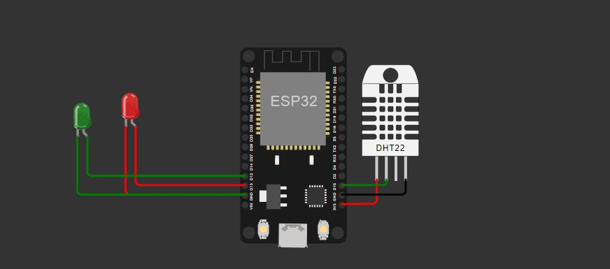
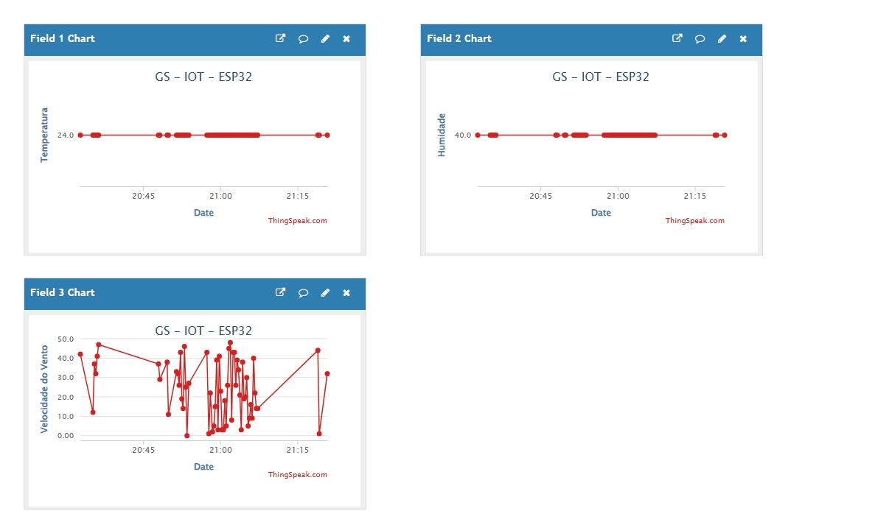

# 🌤️ Monitoramento Climático com ESP32 e ThingSpeak

Este projeto faz parte da disciplina **Disruptive Architectures: IoT, IoB & Generative AI** e tem como objetivo o **monitoramento remoto de condições climáticas**, utilizando um **ESP32 com sensor DHT22**, e envio contínuo dos dados para a plataforma **ThingSpeak**.

⚠️ Este sistema é útil para identificar **condições extremas de temperatura e umidade** e **emitir alertas visuais locais via LEDs**.

---

## 🎯 Objetivos da Solução

- Realizar leituras de **temperatura e umidade em tempo real**
- Simular a **velocidade do vento** (em ambientes sem anemômetro físico)
- **Sinalizar riscos climáticos localmente** com LEDs
- **Enviar dados automaticamente à nuvem (ThingSpeak)**
- Proporcionar uma **base simples, replicável e didática** para projetos de IoT

---

## 📸 Imagens Ilustrativas

### 🔌 Diagrama de Conexão no Wokwi

### 📊 Visualização no Dashboard ThingSpeak

---

## 🧩 Componentes Utilizados

| Componente    | Função                                          |
|---------------|-------------------------------------------------|
| ESP32         | Microcontrolador Wi-Fi                         |
| DHT22         | Sensor de temperatura e umidade                |
| LED Vermelho  | Indica condições climáticas extremas           |
| LED Verde     | Indica ambiente dentro da faixa segura         |
| ThingSpeak    | Armazena e exibe dados em tempo real na nuvem  |
| Wokwi         | Simulador virtual para prototipagem            |

---
## 📊 Dashboard no ThingSpeak

Para facilitar a visualização e o monitoramento dos dados coletados pelo sensor DHT22, foi criada uma **dashboard personalizada** na plataforma ThingSpeak.  

### Funcionalidades da Dashboard

- **Gráficos em tempo real**: Exibe a evolução da **temperatura**, **umidade** e **velocidade do vento** com atualização automática conforme os dados chegam do ESP32.
- **Visualização clara**: Cada parâmetro possui um gráfico individual, permitindo uma análise detalhada de cada variável ambiental.
- **Histórico de dados**: Os dados são armazenados no ThingSpeak, possibilitando consultas e análises históricas a qualquer momento.
- **Alertas visuais**: A dashboard evidencia visualmente situações fora dos parâmetros normais, permitindo uma resposta rápida.

### Como funciona

1. O ESP32 envia os dados via HTTP para o ThingSpeak usando a chave API configurada.
2. O ThingSpeak recebe os dados e atualiza os gráficos da dashboard automaticamente.
3. O usuário pode acessar a dashboard pelo navegador para monitorar as condições ambientais em tempo real e historicamente.

### Benefícios

- Monitoramento remoto, sem a necessidade de estar próximo ao dispositivo.
- Interface amigável e acessível de qualquer dispositivo conectado à internet.
- Suporte a alertas e integrações futuras com outras plataformas IoT.

---

## 🔁 Fluxo Detalhado da Comunicação

Este projeto envolve um fluxo contínuo e automático de dados entre três componentes principais:

### 1. Sensor e Dispositivo (ESP32 + DHT22)

- O ESP32 conectado ao sensor DHT22 faz leituras periódicas de **temperatura** e **umidade**.
- Também é gerada uma simulação da **velocidade do vento** para enriquecer os dados.
- Com base nesses valores, o ESP32 aciona dois LEDs para indicar:
  - **LED Verde:** ambiente estável, dentro das faixas de temperatura e umidade consideradas seguras.
  - **LED Vermelho:** alerta para condições extremas (temperatura ou umidade fora da faixa segura).
- Esse dispositivo atua como um **gateway local**, realizando o pré-processamento dos dados.

### 2. Comunicação via Wi-Fi

- O ESP32 se conecta a uma rede Wi-Fi (neste projeto, rede “Wokwi-GUEST” para simulação).
- A cada 15 segundos, o ESP32 monta uma requisição HTTP do tipo GET contendo os dados coletados.
- Essa requisição é enviada para o serviço ThingSpeak usando uma URL com a chave API e os valores dos sensores.

### 3. Plataforma ThingSpeak (Nuvem)

- ThingSpeak recebe os dados via API REST.
- Os valores são armazenados em campos específicos (field1, field2, field3).
- O ThingSpeak disponibiliza um dashboard online que mostra os dados em tempo real, com gráficos que facilitam a visualização da evolução das condições ambientais.
- Essa plataforma funciona como um servidor na nuvem, armazenando dados históricos e permitindo monitoramento remoto.

---

### Resumo do Fluxo

| Etapa              | Atividade                                           |
|--------------------|----------------------------------------------------|
| 1. Leitura         | ESP32 lê temperatura e umidade com DHT22            |
| 2. Avaliação       | Decisão sobre condição estável ou extrema (LEDs)    |
| 3. Envio           | ESP32 envia dados para ThingSpeak via HTTP GET      |
| 4. Armazenamento   | ThingSpeak recebe e armazena os dados                |
| 5. Visualização    | Dados exibidos no dashboard para monitoramento remoto |

---

Essa arquitetura permite o monitoramento local (LEDs) e remoto (ThingSpeak) de forma integrada e contínua, facilitando a criação de soluções IoT eficientes, escaláveis e fáceis de replicar.

